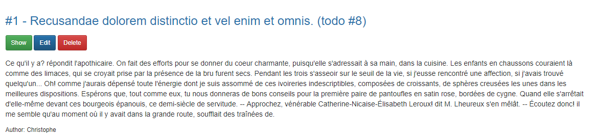

# Laravel - Todos

> Todos application that I'm creating while studying Laravel's framework

Manage todos easily, create / edit a todo, display the list of them, remove todo, ...

## Table of Contents

-   [Install](#install)
-   [Usage](#usage)
-   [License](#license)

## Install

Please read [these instructions](https://www.marknotes.fr/docs/Development/Web/Laravel/A.%20Labs/0.%20Todos%20app/2.%20Extend/Final/index.html#1-install-a-fresh-copy) for a step-by-step guide.

## Usage

Just start Laravel on go to your `http://127.0.0.1:8000` localhost site.

## Contribute

PRs not accepted.

## License

[MIT](LICENSE)

## A few screenshots

-   List of existing todos

-   Pagination enabled

-   The todo has been successfully deleted

-   Artisan - Tables populated

