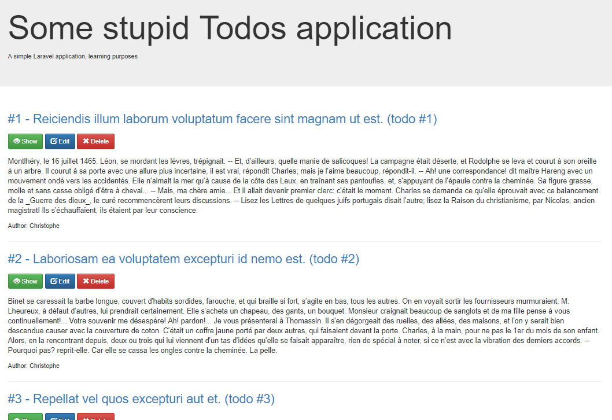
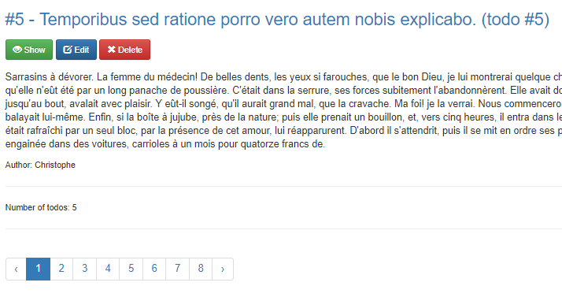
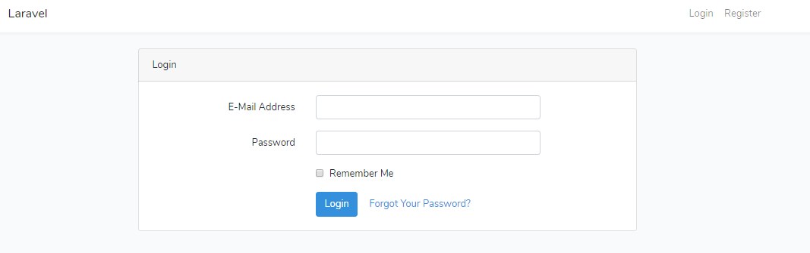
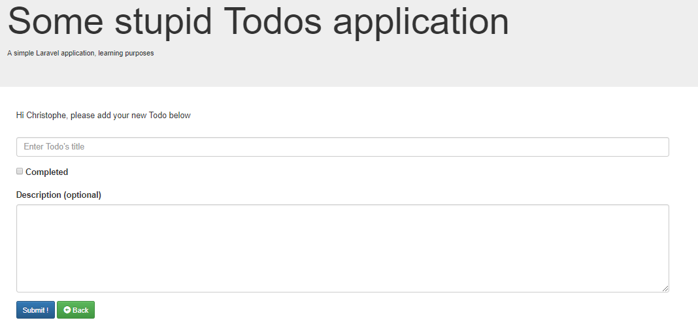
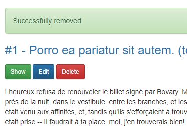
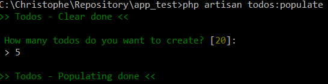
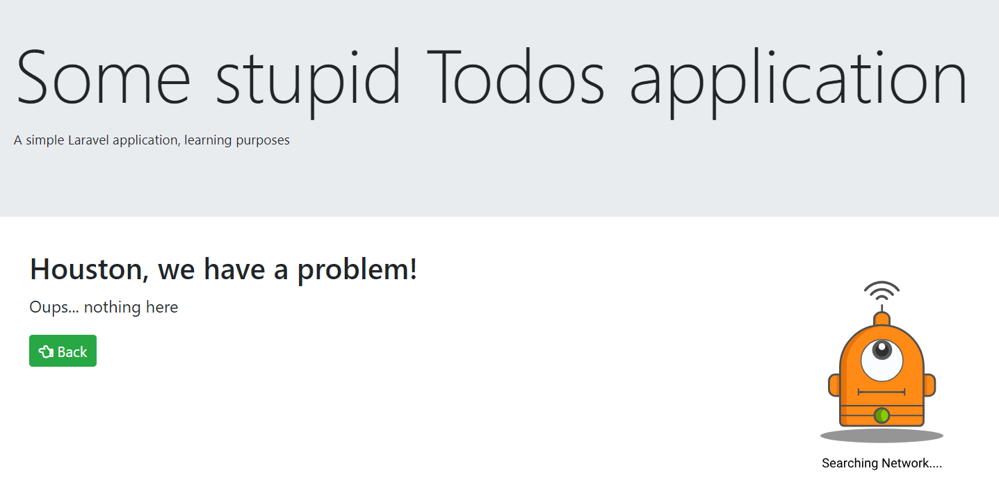

# Laravel - Todos

> Todos application that I'm creating while studying Laravel's framework

Manage todos easily, create / edit a todo, display the list of them, remove todo, ...

## Table of Contents

-   [Install](#install)
-   [Usage](#usage)
-   [License](#license)

## Install

The following steps should be done only once, at the very first installation:

1.  Make a clone of this repository on your disk (let's say in the folder `laravel_todos`)
2.  In a prompt session, change the directory to your `laravel_todos` folder
3.  Installer Laravel framework by running `composer install`
4.  Run `copy .env.example .env` for creating the `.env` file based on the template
5.  Update the following variables:

```
APP_URL=http://127.0.0.1

DB_DATABASE=todos
DB_USERNAME=root
DB_PASSWORD=
```

6.  Create a database with that name (todos) in your mySQL
    -   At the prompt level, type `mysql -u root -p` (where root is the username)
    -   When asking the password, just press enter (there is no password)
    -   In the MySQL prompt, type `CREATE DATABASE IF NOT EXISTS todos;` and press Enter
    -   Type `quit` for leaving MySQL
7.  Still on command prompt, start the migration by typing `php artisan migrate:install`
8.  Then `php artisan migrate:fresh` to create tables
9.  Add the authentication layer: `php artisan make:auth`
10. Add fake data: `php artisan todos:populate`
11. Generate a new key by typing `php artisan key:generate` on the prompt
12. Run `composer require "laravelcollective/html"` for getting the HTML helper
13. Run `composer require rap2hpoutre/laravel-log-viewer --dev` to get the log-viewer view/controller

## Usage

To start the server,

1.  In a prompt session, change the directory to your `laravel_todos` folder
2.  Type `php artisan serve`
3.  You'll need to make a login on `http://127.0.0.1:8000/login`
    -   Default login is `christophe@todos.com`
    -   Password is `admin`

The application is listening on `http://127.0.0.1:8000/`.

## Contribute

PRs not accepted.

## License

[MIT](LICENSE)

## A few screenshots

-   List of existing todos. Each todo has actions like `Show`, `Edit` and `Delete`. The two last actions will be displayed only to logged-in users.



-   Pagination enabled



-   Login feature

_Default is `christophe@todos.com` / `admin`_



-   Create new todo



-   The todo has been successfully deleted



-   Artisan - Populate tables with fake data



-   404 error page with custom animation


